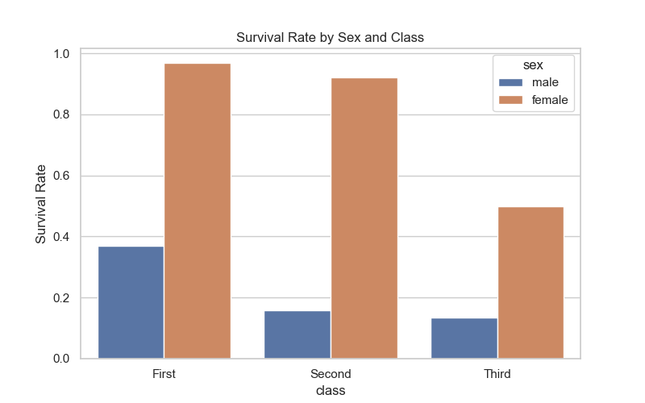
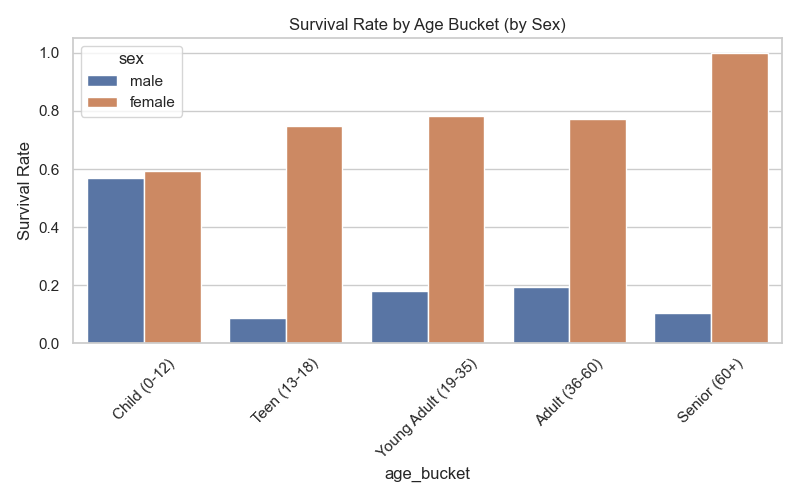
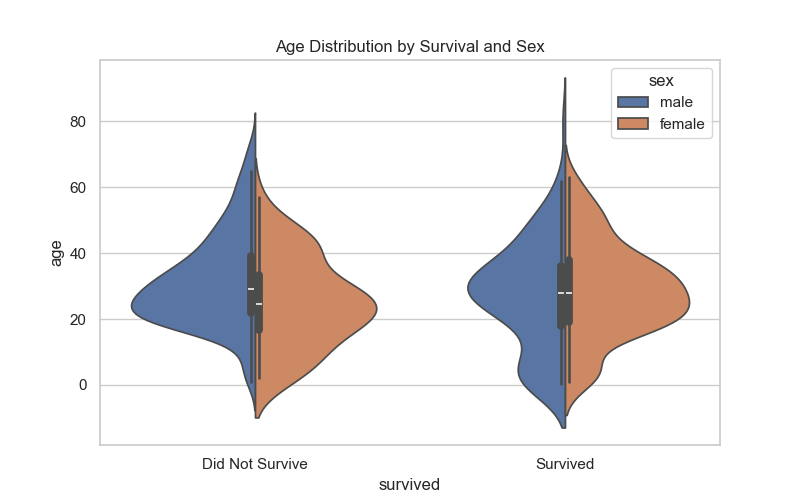
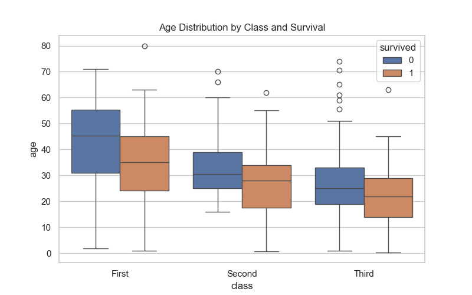

# Titanic Dataset Exploratory Data Analysis (EDA) Insights

## Key Insights
1. **Gender and Survival**: Females had a significantly higher survival rate (74.2%) compared to males (18.9%).
2. **Class and Survival**: Passenger class was a strong predictor of survival. First-class passengers had the highest survival rate (63.0%), followed by second-class (47.3%) and third-class (24.2%).
3. **Age and Survival**: Children (0-12 years) had the highest survival chances (58.0%), while seniors (60+ years) had the lowest (22.7%).
4. **Missingness**: The dataset presented significant missingness in the `age` (177 missing values) and `deck` (688 missing values) columns.
5. **Combined Effect of Age and Class**: As visualized in the box and violin plots, young children across classes were prioritized, but third-class passengers overall had a starkly higher mortality rate regardless of age (except for young children).

## Visualizations
### Survival Rate by Sex and Class

### Survival Rate by Age Bucket

### Age Distribution by Survival and Sex (Violin Plot)

### Age Distribution by Class and Survival (Boxplot)

